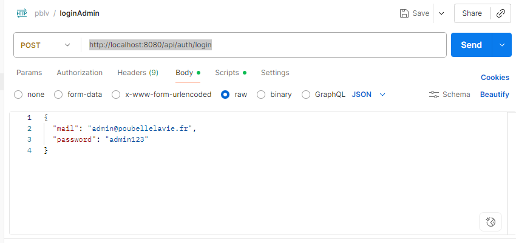
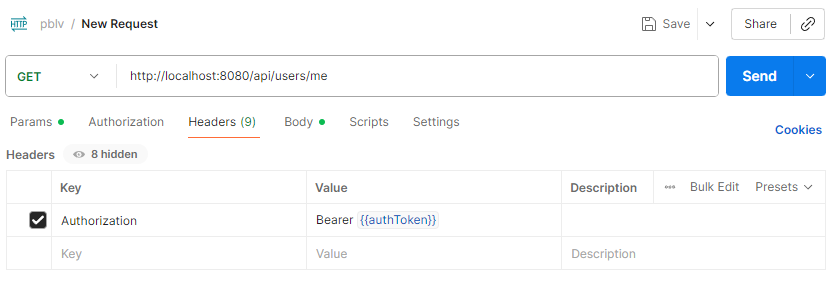

# Poubelle la vie

##  Repositories

Cloner les branches **main** repositories suivants :

- **Front-end** : https://github.com/LeTinmz/pblv-front
- **Back-end (API)** : https://github.com/ErwinBezu/poubelle-la-vie-backend
- **Back-office** : https://github.com/ErwinBezu/pblv-backoffice
## Prérequis

Avant de commencer, assurez-vous que :

- **MySQL** est installé et démarré
- **MongoDB** est installé et démarré
- **Node.js** et **npm** sont installés
## Lancement du Back-end

1. Ouvrir le projet **poubelle-la-vie-backend** dans IntelliJ IDEA de préférence .
2. Copier le fichier `.env.example` et renommer la copie en `.env` :

```
cp .env.example .env
```
3. Lancer l'application via IntelliJ IDEA

Si vous rencontrez des problèmes de communication avec le front-end, vérifiez la configuration des **CORS**.
Si besoin ajouté `"*",` ligne 77 `"http://localhost:5173",` avant dans `src/main/java/org/example/poubellelavie/config/SecurityConfig.java` pour tester.
## Lancement du Front-end

1. Ouvrir le projet **front-end**
2. Récupérer son **l'Adresse IPV4** (192.168.XX.XXX)
	```ipconfig```
3. Dans `/utils/api.js` remplacher ``config.API_BASE_URL`` ligne 5 par ``http://<votreAdresseIPV4>:8080/api/``
4. Installer les dépendances :
	``npm install``
Démarrer l'application :
	``npx expo start --tunnel``

## Lancement du Back-office
1. Ouvrir le projet **back-office**
2. Installer les dépendances :
	``npm install``
3. Lancer l'application :
	``npm run start``

## Accès
* L'application est disponible avec le QR expo ou sur navigateur à l'adresse http://localhost:8081
* Le Back-office à l'adresse http://localhost:5173
* L'API est accessible à l'adresse http://localhost:8080 mais sécurisée et renvoie une erreur 401 sans token.

## Test connexion API avec Postman
1. s'identifier sur la route http://localhost:8080/api/auth/login en **POST**
	

	- dans **Body** : 
		```
		{
		"mail" : "admin@poubellelavie.fr",
		"password": "admin123"
		}
		```
	- dans **Scripts** :
		```
		if (pm.response.code === 200) {

		    const responseJson = pm.response.json();

		    const token = responseJson.data?.token;

		

		    if (token) {

		        pm.collectionVariables.set("authToken", token);

		        console.log("✅ Token JWT sauvegardé");

		        console.log("Token (début):", token.substring(0, 30) + "...");

		    } else {

		        console.log("❌ Token non trouvé");

		    }

		} else {

		    console.log("❌ Erreur de login:", pm.response.code);
		    }
		```

2. Pour tester des routes en **GET** vérifier la partie **Headers**
	

## Documetation

Liste des routes de l'Api accessible quand le back-end tourne : http://localhost:8080/swagger-ui/index.html#/
